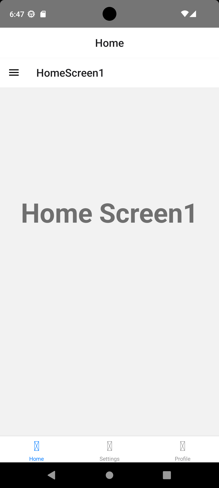
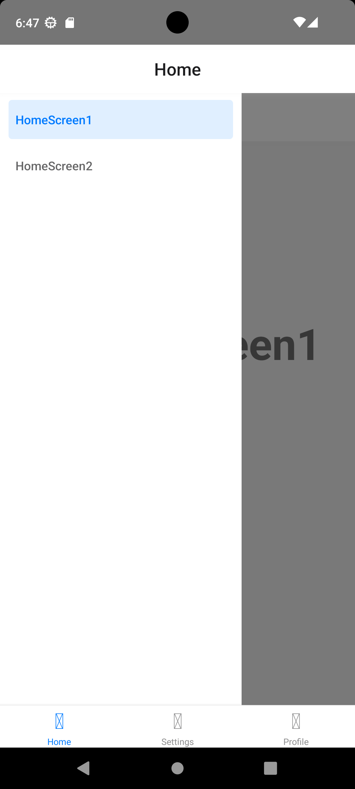
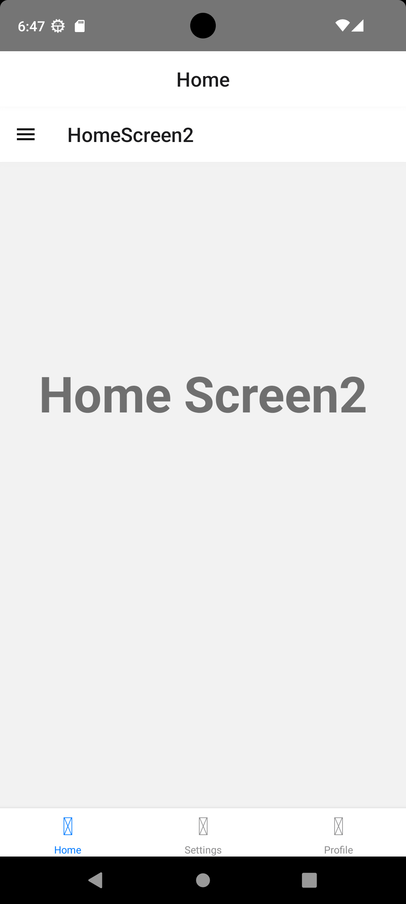
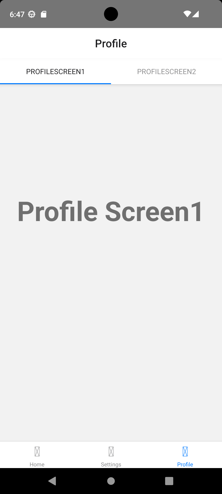
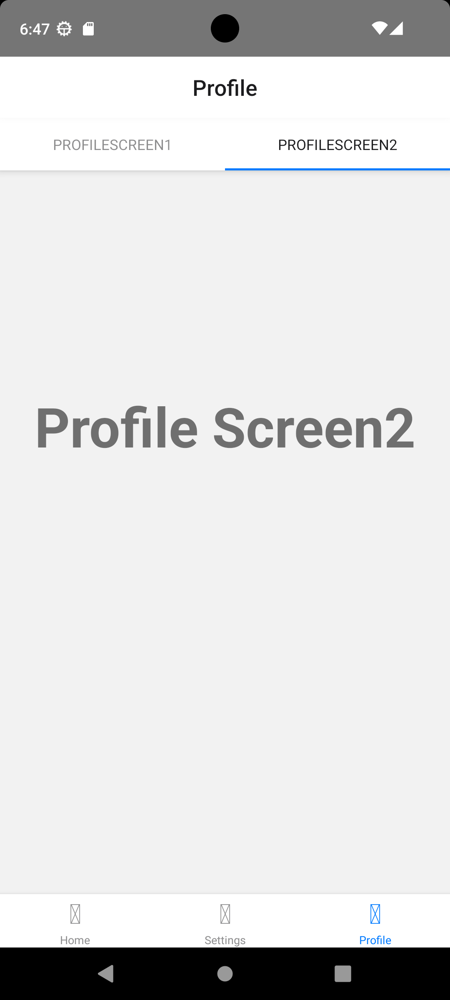
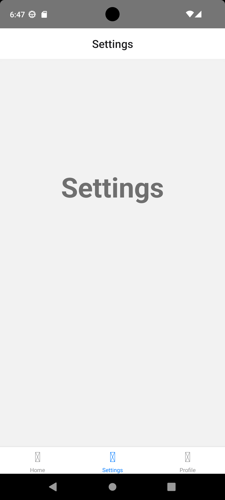

## Home screen
### Main screen shows home screen 1 and bottom tab that has home,setting and profile screens.

## Drawer and Home screen 2
### Drawer can be used to switch between Home screen 1 and home screen 2

## Profile screen
### Profile screen 1 and 2 can be switched using material top tab

## Settings screen

